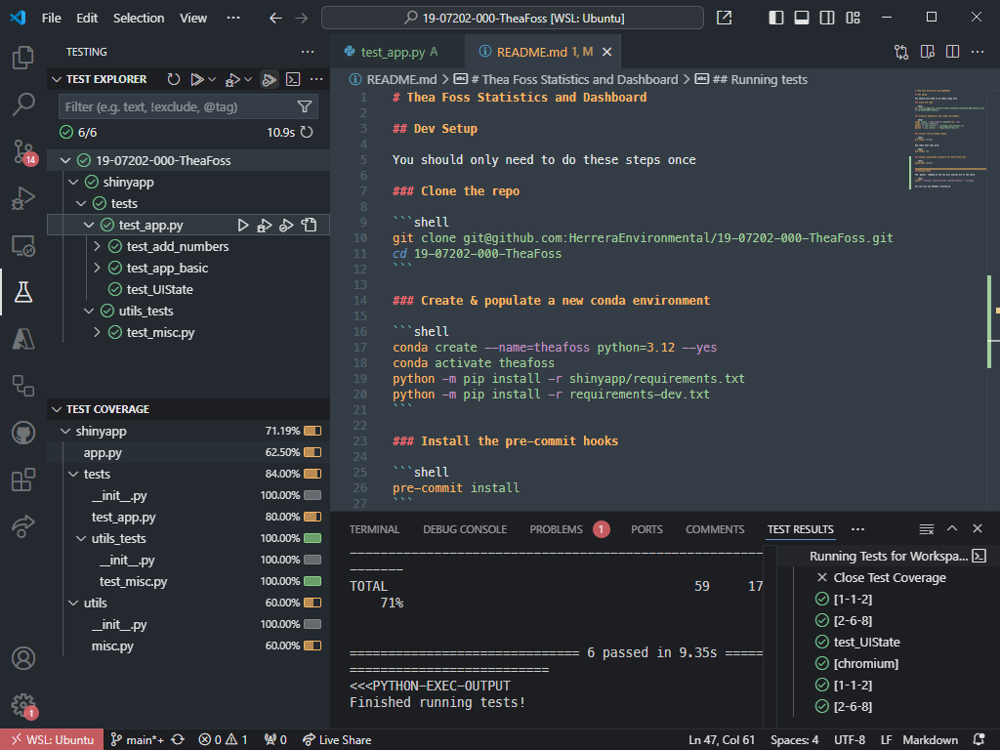
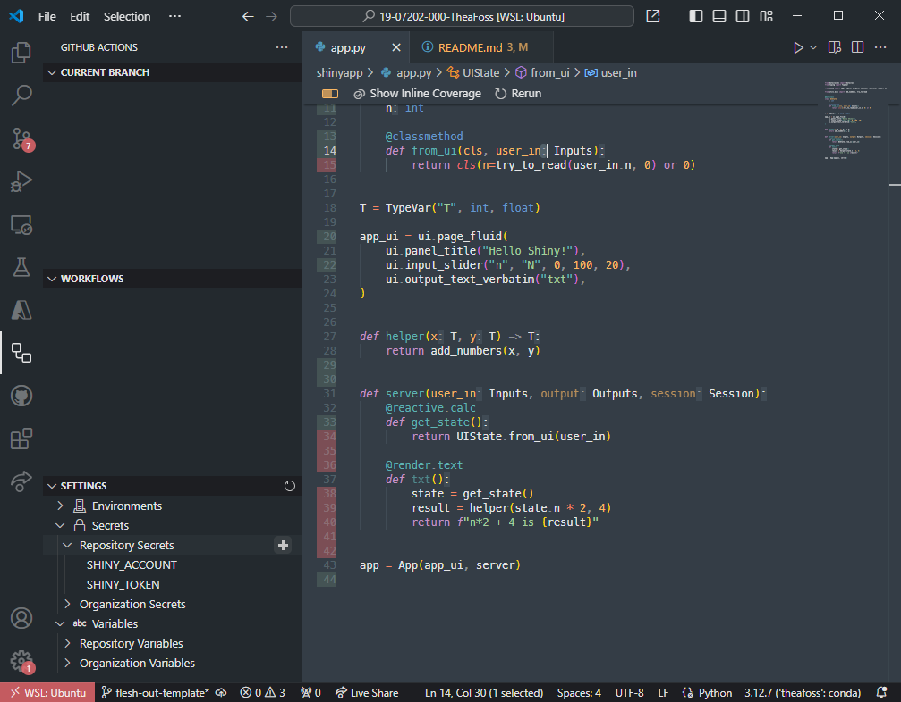
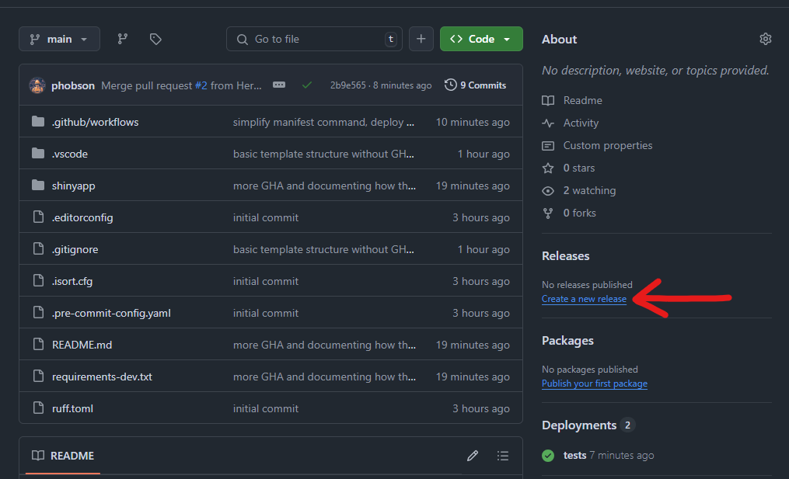
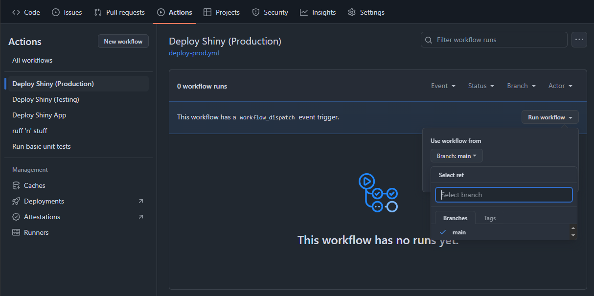

# Dashboard Template for Pyshiny

## Dev Setup

> ℹ**Note**ℹ<br>
You should only need to do these steps once.

### Clone the repo

```shell
git clone git@github.com:HerreraEnvironmental/hec-pyshiny-template.git
cd hec-pyshiny-template
```

### Create & populate a new conda environment

```shell
conda create --name=shinyproj python=3.12 --yes
conda activate shinyproj
python -m pip install -r shinyapp/requirements.txt
python -m pip install -r requirements-dev.txt
```

### Install the pre-commit hooks

```shell
pre-commit install
```

And check that they work:

```shell
pre-commit run
```

### Install playwright browsers for end-to-end test

```shell
playwright install
```

## Running tests

The `pytest` command at the CLI will execute all of the tests.

```shell
pytest --verbose --durations=10 --doctest-modules --cov
```

You can also use VSCode's testing UI.



## Deploying

### Manually (i.e., the first time)

First, make sure that you've followed the instructions to setup a development environment and that `rsconnect` in particular is available from the environment.
Once that's done, the basic process is to write a *manifest.json* file, deploy a test app, and then deploy a production app.

Ideally you deploy to "{appname}" and "{appname-test}.
This will allow you to best take advantage of the Github Action-based deployment described below.

To deploy a brand-new app, do the following from within the `shinyapp` directory:

```shell
# write the manifest file
rsconnect write-manifest shiny . \
    --entrypoint=app.py \
    --overwrite \
    --exclude=tests \
    --exclude="**/__pycache__/*"
```

After you run that, inspect the "manifest.json" file to make sure no extraneous or *sensitive* files  were included.
If they were, you can delete from the manifest file.
You should also modify the Github actions described below (deploy-helper.yml) and add more `--exclude` statements to prevent the inclusion of the files in the future.

Once you're happy with the content of the manifest file, you can deploy the "test" app with the following command (still in the `shinyapp` directory):

```shell
rsconnect deploy manifest manifest.json \
  --name=<appname>-test
  --account=<herrera account name>
  --token=<herrera token>
  --secret=<herrera secret>
  --new
```

Contact <shinyadmin@herrerainc.com> to learn the value of those place holders.

> ⚠**Warning**⚠<br>
If you run the above command multiple time and include the `--new` flag, ShinyApp.io will create an entirely seperate app each time, appending a number to the end of the app name (e.g., myapp-test1, myapp-test2).
After the initial deployment, drop the `--new` flag if you decide to deploy manually.

If the test deployment goes well, you can deploy the "production" app:

```shell
rsconnect deploy manifest manifest.json \
  --title=<appname>
  --account=<herrera account name>
  --token=<herrera token>
  --secret=<herrera secret>
  --new
```

If that goes well, move on to the next section.

### Continuous Deployment via Github Actions

If the app has never been deployed, then you *must* deploy manually (see above) before the Github Actions will work.
This is because the initial manual deployment is what allows you to get the App ID from the Shiny Admin page.
Contact <shinyadmin@herrerainc.com> if you need help getting find your App IDs.

Once you have the account ID, account token, account secret, and the test and production app IDs, create the following Github repository secrets:

- SHINY_ACCOUNT
- SHINY_TOKEN
- SHINY_SECRET
- SHINY_ID_TEST
- SHINY_ID_PROD

You can add these on the repository's webpage at Github.
Or, if you have the Github Actions extension installed in VSCode, you can set them there.



After you've set the secrets, Github Actions will deploy your app based on the following rules:

1. If you merge or push new code into the `main` branch *and* the unit test Github Action completes successfully, the test app will deploy
1. If you push a git tag or create a release via Github, the production app will deploy.

To see all of the previous releases (tags):

```shell
git fetch origin --tags
git tag --list
```

When you're ready to relese to production, create a new tag.
You can do this via Github:



Or via the command line. Assuming the previous version was e.g., "0.1.2", and this is a micro release:

```shell
git tag -a "v0.1.3"
# <!-- add release notes in editor --!>
git push origin --tags
```

If you ever roll out a bad release and want to revert, you can do that at Github in the Actions tab of the repository, selecting the last good tag you'd like to redeploy:


